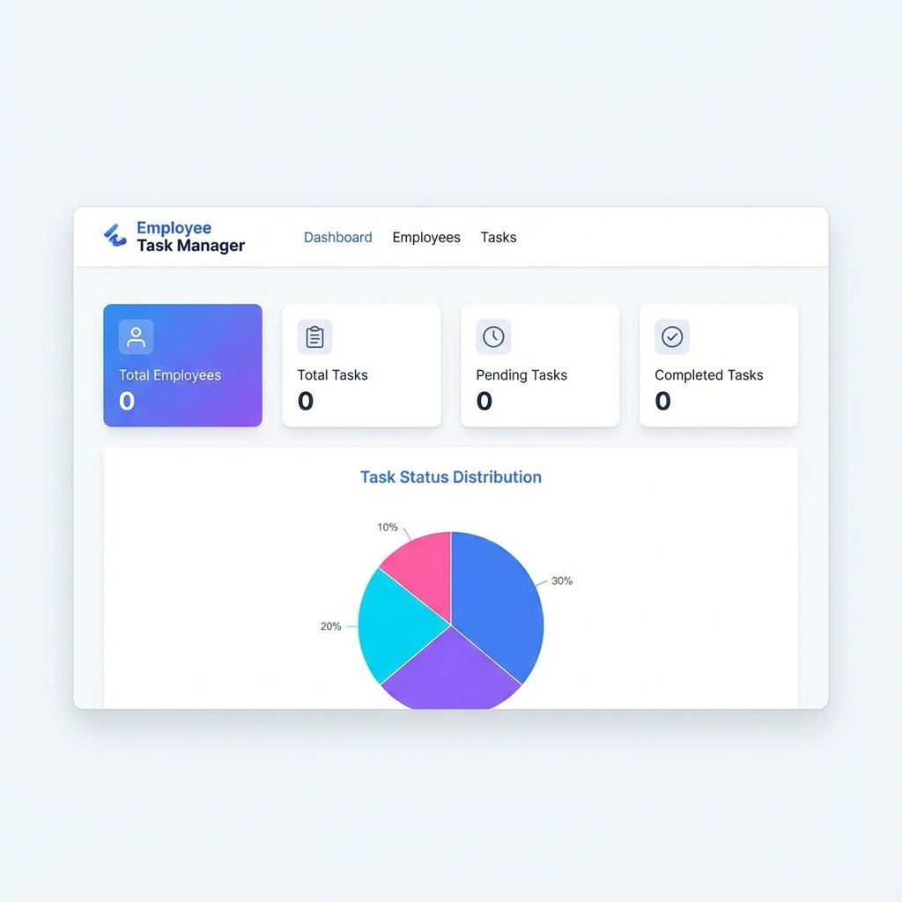
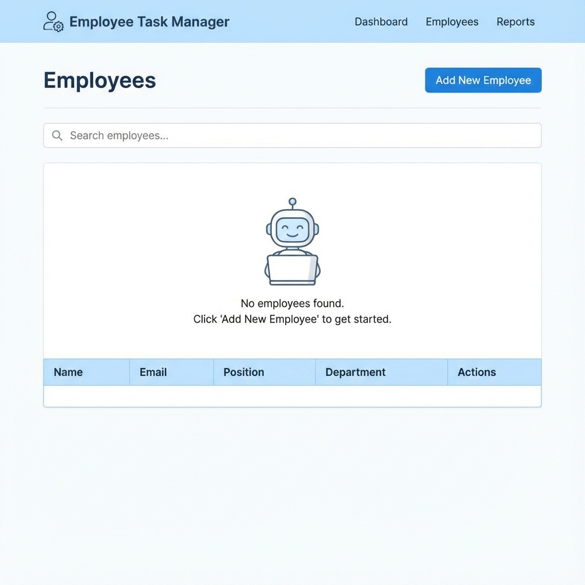
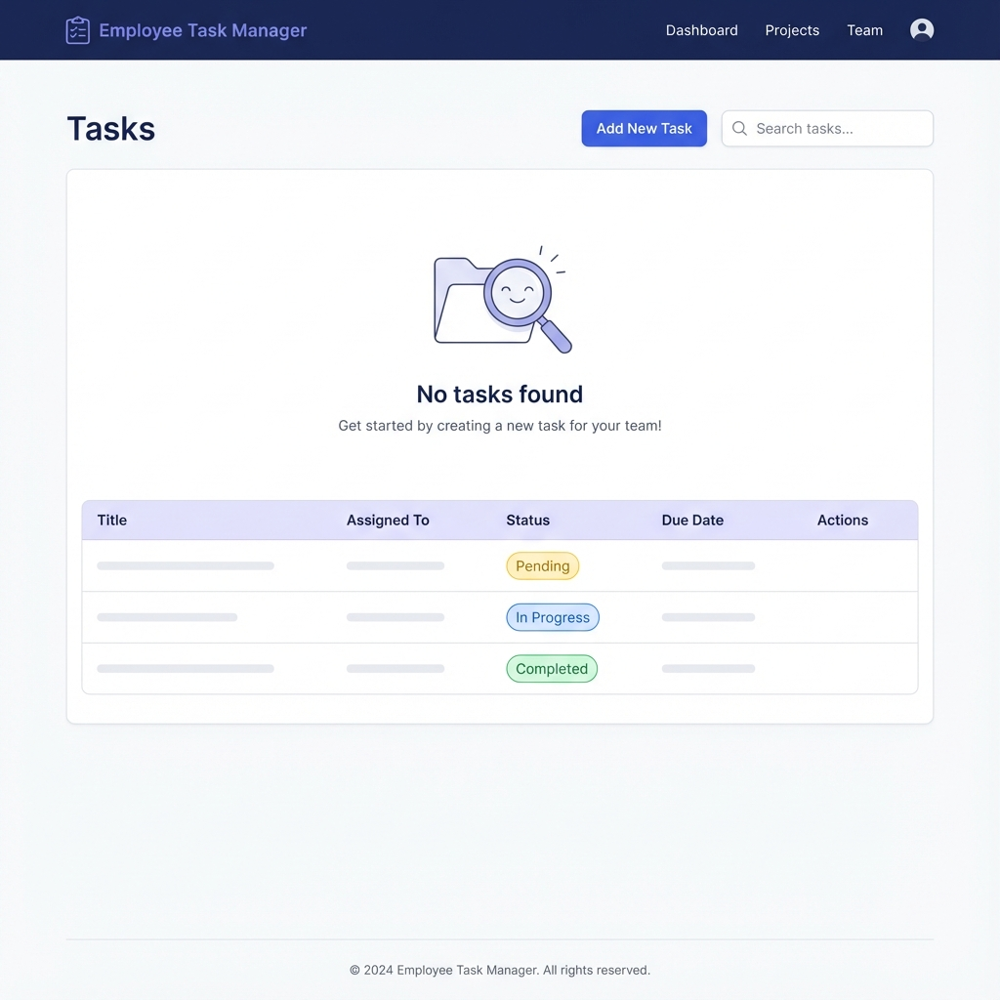

# Employee Task Manager

A modern, full-stack web application for managing employees and tasks with an intuitive interface, real-time data synchronization, and comprehensive CRUD operations.



## 📋 Table of Contents

- [Features](#-features)
- [Tech Stack](#-tech-stack)
- [Screenshots](#-screenshots)
- [Setup Instructions](#-setup-instructions)
- [Project Structure](#-project-structure)
- [API Endpoints](#-api-endpoints)
- [Assumptions](#-assumptions)
- [Bonus Features](#-bonus-features)
- [Deployment](#-deployment)
- [License](#-license)

## ✨ Features

### Core Features
- 👥 **Employee Management**: Complete CRUD operations for employee records
- ✅ **Task Management**: Create, assign, update, and delete tasks
- 📊 **Dashboard**: Real-time statistics and visual charts
- 🔍 **Search & Filter**: Quick search functionality across employees and tasks
- 📱 **Responsive Design**: Works seamlessly on desktop, tablet, and mobile devices

### User Experience
- 🎨 Modern, clean UI with intuitive navigation
- 🔄 Real-time data synchronization
- ⚡ Fast and responsive interface
- 🎯 Status tracking for tasks (Pending, In Progress, Completed)
- 📈 Visual data representation with charts

## 🛠 Tech Stack

### Frontend
| Technology | Version | Purpose |
|------------|---------|---------|
| **React** | 18.2.0 | UI framework |
| **Vite** | 5.0.8 | Build tool and dev server |
| **React Router DOM** | 6.20.1 | Client-side routing |
| **Axios** | 1.6.2 | HTTP client for API calls |
| **Recharts** | 2.10.3 | Data visualization and charts |

### Backend
| Technology | Version | Purpose |
|------------|---------|---------|
| **Node.js** | ≥18.0.0 | Runtime environment |
| **Express** | 4.18.2 | Web framework |
| **MongoDB** | - | NoSQL database |
| **Mongoose** | 8.0.3 | MongoDB ODM |
| **CORS** | 2.8.5 | Cross-origin resource sharing |
| **dotenv** | 16.3.1 | Environment variable management |

### Development Tools
- **Nodemon** (3.0.2) - Auto-restart server during development
- **ESLint** - Code linting and quality
- **Git** - Version control

## 📸 Screenshots

### Dashboard View

*Real-time statistics showing total employees, tasks, and status distribution with interactive charts*

### Employee Management

*Complete employee listing with add, edit, and delete capabilities*

### Task Management

*Comprehensive task tracking with status updates and employee assignment*

## 🚀 Setup Instructions

### Prerequisites

Before you begin, ensure you have the following installed:
- **Node.js** (v18.0.0 or higher) - [Download here](https://nodejs.org/)
- **MongoDB** - Choose one:
  - Local installation - [Download here](https://www.mongodb.com/try/download/community)
  - MongoDB Atlas (cloud) - [Sign up here](https://www.mongodb.com/cloud/atlas)
- **Git** - [Download here](https://git-scm.com/)
- **npm** (comes with Node.js)

### Installation Steps

#### 1. Clone the Repository
```bash
git clone https://github.com/sai0706/prou-assignment.git
cd prou-assignment
```

#### 2. Backend Setup

Navigate to the backend directory and install dependencies:
```bash
cd backend
npm install
```

Create a `.env` file in the `backend` directory:
```bash
# For Windows PowerShell
New-Item .env

# For Mac/Linux
touch .env
```

Add the following environment variables to `.env`:
```env
PORT=5000
MONGODB_URI=mongodb://localhost:27017/employee-task-db
```

> **Note**: If using MongoDB Atlas, replace the `MONGODB_URI` with your Atlas connection string:
> ```
> MONGODB_URI=mongodb+srv://<username>:<password>@cluster.mongodb.net/employee-task-db
> ```

Start the backend server:
```bash
# Development mode (with auto-restart)
npm run dev

# Production mode
npm start
```

The backend server will start on `http://localhost:5000`

#### 3. Frontend Setup

Open a new terminal window, navigate to the frontend directory:
```bash
cd frontend
npm install
```

Start the frontend development server:
```bash
npm run dev
```

The frontend will start on `http://localhost:5173`

#### 4. Access the Application

Open your browser and navigate to:
- **Frontend**: http://localhost:5173
- **Backend API**: http://localhost:5000/api

### Quick Start (All-in-One)

For convenience, you can run both servers simultaneously using two terminal windows:

**Terminal 1 (Backend):**
```bash
cd backend && npm install && npm run dev
```

**Terminal 2 (Frontend):**
```bash
cd frontend && npm install && npm run dev
```

## 📁 Project Structure

```
employee-task-manager/
├── backend/
│   ├── models/
│   │   ├── Employee.js       # Employee schema
│   │   └── Task.js           # Task schema
│   ├── routes/
│   │   ├── employees.js      # Employee API routes
│   │   └── tasks.js          # Task API routes
│   ├── .env                  # Environment variables
│   ├── server.js             # Express server setup
│   └── package.json          # Backend dependencies
├── frontend/
│   ├── src/
│   │   ├── components/
│   │   │   └── Navbar.jsx    # Navigation component
│   │   ├── pages/
│   │   │   ├── Dashboard.jsx      # Dashboard page
│   │   │   ├── EmployeeList.jsx   # Employee management
│   │   │   └── TaskList.jsx       # Task management
│   │   ├── config.js         # API configuration
│   │   ├── index.css         # Global styles
│   │   ├── App.jsx           # Main app component
│   │   └── main.jsx          # Entry point
│   ├── index.html            # HTML template
│   ├── vite.config.js        # Vite configuration
│   └── package.json          # Frontend dependencies
├── docs/                     # Screenshots and documentation
├── .gitignore               # Git ignore rules
├── DEPLOYMENT.md            # Deployment guide
├── README.md                # This file
└── render.yaml              # Render deployment config
```

## 🔌 API Endpoints

### Employee Endpoints

| Method | Endpoint | Description |
|--------|----------|-------------|
| GET | `/api/employees` | Get all employees |
| GET | `/api/employees/:id` | Get single employee by ID |
| POST | `/api/employees` | Create new employee |
| PUT | `/api/employees/:id` | Update employee |
| DELETE | `/api/employees/:id` | Delete employee |

**Employee Schema:**
```json
{
  "name": "string (required)",
  "email": "string (required, unique)",
  "position": "string (required)",
  "department": "string (required)"
}
```

### Task Endpoints

| Method | Endpoint | Description |
|--------|----------|-------------|
| GET | `/api/tasks` | Get all tasks |
| GET | `/api/tasks/:id` | Get single task by ID |
| POST | `/api/tasks` | Create new task |
| PUT | `/api/tasks/:id` | Update task |
| DELETE | `/api/tasks/:id` | Delete task |

**Task Schema:**
```json
{
  "title": "string (required)",
  "description": "string (required)",
  "assignedTo": "ObjectId (Employee reference, required)",
  "status": "string (enum: ['Pending', 'In Progress', 'Completed'], default: 'Pending')",
  "dueDate": "Date (required)"
}
```

## 📝 Assumptions

The following assumptions were made during development:

1. **Authentication**: The application does not include user authentication or authorization. It's assumed to be used in a trusted internal environment.

2. **Data Validation**: Basic validation is implemented on both frontend and backend. Email uniqueness is enforced for employees.

3. **Task Assignment**: Tasks can only be assigned to existing employees. If an employee is deleted, their associated tasks remain but show as unassigned.

4. **Date Handling**: All dates are stored in UTC and displayed in the user's local timezone.

5. **Database**: MongoDB is used as the database. The application assumes MongoDB is running and accessible via the connection string in the `.env` file.

6. **Environment**: The application is designed for modern browsers (Chrome, Firefox, Safari, Edge - latest versions).

7. **Network**: The frontend assumes the backend API is accessible at the configured API URL (default: `http://localhost:5000/api`).

8. **Concurrent Users**: The application doesn't implement real-time synchronization for multiple concurrent users. Users need to refresh to see changes made by others.

## 🎁 Bonus Features

The following additional features were implemented beyond the basic requirements:

### 1. **Dashboard with Analytics** 📊
- Real-time statistics showing total employees and tasks
- Task status distribution (Pending, In Progress, Completed)
- Interactive pie chart for visual task status representation
- Employee count and task count cards

### 2. **Modern UI/UX** 🎨
- Clean, professional design with consistent color scheme
- Responsive layout that works on all device sizes
- Smooth transitions and hover effects
- Intuitive navigation with active state indicators

### 3. **Search Functionality** 🔍
- Quick search across employee names and positions
- Real-time filtering of task lists
- Case-insensitive search

### 4. **Enhanced Task Management** ✅
- Visual status indicators with color coding
- Due date tracking and display
- Task description with rich text support
- Employee assignment with dropdown selection

### 5. **Data Visualization** 📈
- Recharts integration for beautiful, interactive charts
- Pie chart showing task status distribution
- Responsive chart sizing

### 6. **Error Handling** 🛡️
- Comprehensive error messages for API failures
- Form validation with user-friendly feedback
- Graceful handling of network errors

### 7. **Deployment Ready** 🚀
- Complete deployment configuration for Render
- Environment-based API configuration
- Production build optimization
- Detailed deployment documentation

### 8. **Code Quality** ✨
- Clean, maintainable code structure
- Consistent coding style
- Modular component architecture
- Proper separation of concerns

## 🌐 Deployment

This application is configured for easy deployment to Render. See [DEPLOYMENT.md](./DEPLOYMENT.md) for detailed instructions.

### Quick Deploy to Render

1. Push your code to GitHub
2. Connect your GitHub repository to Render
3. Render will automatically detect the `render.yaml` configuration
4. Set up your MongoDB Atlas connection string
5. Deploy!

The application is production-ready with:
- Optimized build configuration
- Environment variable management
- CORS configuration for production
- Static file serving

## 🤝 Contributing

Contributions are welcome! Please feel free to submit a Pull Request.

## 📄 License

This project is licensed under the MIT License - see the LICENSE file for details.

## 👨‍💻 Author

Developed as part of a technical assignment.

## 🙏 Acknowledgments

- React team for the amazing framework
- MongoDB for the flexible database
- Recharts for beautiful data visualization
- Vite for lightning-fast development experience

---

**Note**: This is a demonstration project built for educational purposes. For production use, consider adding authentication, authorization, input sanitization, rate limiting, and other security measures.
